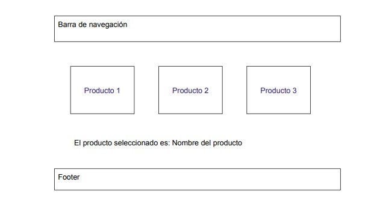
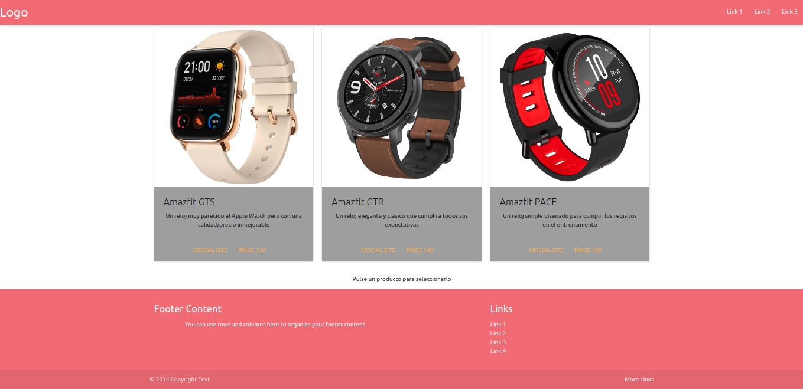

# Practica de Web Component

## Objetivo de la práctica


Crear un web component para encapsular el contenido central de la página siguiente:




Para realizar esta práctica he seguido los siguientes pasos:


### Pagina Web Base

- He creado un barra nav utilizando materialize. Desta forma rapida y sencila podemos obtener una barra de navegacion para poder visualizar como quedaría finalmente la página. Destacar que no tiene funcionalidad simplemente es a modo visual ya que lo importante es la parte central de la página.

    ```html
    <!-- Navegacion-->
    <nav>
        <div class="nav-wrapper">
          <a href="#" class="brand-logo">Logo</a>
          <ul id="nav-mobile" class="right hide-on-med-and-down">
            <li><a href="#">Link 1</a></li>
            <li><a href="#">Link 2</a></li>
            <li><a href="#">Link 3</a></li>
          </ul>
        </div>
      </nav>
    ```

- Por otro lado se ha creado un **footer* de la misma forma que la barra de navegacion, haciendo uso de materialize. 

    ```html
    <!-- FOOTERR-->
    <footer class="page-footer">
        <div class="container">
          <div class="row">
            <div class="col l6 s12">
              <h5 class="white-text">Footer Content</h5>
              <p class="grey-text text-lighten-4">You can use rows and columns here to organize your footer content.</p>
            </div>
            <div class="col l4 offset-l2 s12">
              <h5 class="white-text">Links</h5>
              <ul>
                <li><a class="grey-text text-lighten-3" href="#!">Link 1</a></li>
                <li><a class="grey-text text-lighten-3" href="#!">Link 2</a></li>
                <li><a class="grey-text text-lighten-3" href="#!">Link 3</a></li>
                <li><a class="grey-text text-lighten-3" href="#!">Link 4</a></li>
              </ul>
            </div>
          </div>
        </div>
        <div class="footer-copyright">
          <div class="container">
          © 2020 Copyright Text
          <a class="grey-text text-lighten-4 right" href="#!">More Links</a>
          </div>
        </div>
      </footer>


    ```

### Creacion del Web Component

Para la creación del WebComponent he creado un fichero *components.js* y en él crearemo una clase que va a extender de *HTMLElement*:

```javascript
class NuevoProducto extends HTMLElement {

    constructor(){
        super();

    }

    connectedCallback(){
        
        const image = this.getAttribute('img');
        const title = this.getAttribute('title');
        const description = this.getAttribute('description');
        const url_site = this.getAttribute('link-site');
        const price = this.getAttribute('price');

        let div_product = document.createElement('div');
        div_product.innerHTML = `

          <div class="card grey align="center">
            <div class="card-image">
                
            </div>
            <div class="card-content">
              <span class="card-title">${title}</span>
              <p>${description}</p>
            </div>

            <div class="card-action center">

              <a href="${url_site}">Oficial Site</a>
              <a>Price ${price}</a>
            </div>

            <div class="card-reveal">
              <span class="card-title">
                Los detalles del reloj
                <i class="material-icons right">close</i>
                <p>
                  Aqui esta todo el contenido del reloj
                </p>
              </span>
              
            </div>`;

        console.log("se ha añadido un elemento");
      
        this.appendChild(div_product);
        
    }

}

```

Para verlo con más detalles analizemos algunos elementos importantes de este código:

- Constructor():

    Este método se llama cuando se crea o se actualiza el elemento. 

- ConnectedCallback():

    Este metodo se llama cuando el elemento es insertado en el documento.

    En este método se ha añadido una serie de variables a identificar:

    - Las atributos que se le pasa al componente cuando se inserta en el documento y que usaremos para añadir informacion a nuestras *cards*:

    ```javascript

    const image = this.getAttribute('img');
    const title = this.getAttribute('title');
    const description = this.getAttribute('description');
    const url_site = this.getAttribute('link-site');
    const price = this.getAttribute('price');

    ```
    
    - La creacion de un nuevo div que contiene el codigo que vamos a insertar:

    ```javascript
     let div_product = document.createElement('div');
        div_product.innerHTML = `

          <div class="card grey align="center">
            <div class="card-image">
                
            </div>
            <div class="card-content">
              <span class="card-title">${title}</span>
              <p>${description}</p>
            </div>

            <div class="card-action center">

              <a href="${url_site}">Oficial Site</a>
              <a>Price ${price}</a>
            </div>

            <div class="card-reveal">
              <span class="card-title">
                Los detalles del reloj
                <i class="material-icons right">close</i>
                <p>
                  Aqui esta todo el contenido del reloj
                </p>
              </span>
              
            </div>`;
     
    ```

    - Y por último se encuentra la línea en donde añadimos ese elemento al documento.

    ```javascript 
    this.appendChield(div_product);
    
    ```

Con esto ya tendríamos nuestro prototipo de *card* para añadir a nuestra página web pero mieramente tenemos definirlo para poder utilizarlo. Tambien tenemos que tener cuenta que este fichero tenemos que añadirlo a nuestro *index.html* con la etiqueta *<script></script>*.

Usaremos la siguiente para definir nuestro web component:

```javascript
window.customElements.define("product-watch", NuevoProducto);

```

Esto significa que para usar el elemento creado tenemos que utilizar la etiqueta *<product-watch></product-watch>*.

Ahora solo tendriamos que insertar las etiquetas con las variables que hemos definido en nuestro *index.html*.

```html
      <div class="products">
        <div class="row">
          <div class="col s4">
            <product-watch onclick="select_product('Amazfit GTS')" img ='./img/GTS.jpg' title="Amazfit GTS" description="Un reloj muy parecido al Apple Watch pero con una calidad/precio inmejorable" link-site="https://es.amazfit.com/gts.html" price="130"></product-watch>
          </div>
          <div class="col s4">
            <product-watch onclick="select_product('Amazfit GTR')" img ='./img/GTR.jpg' title="Amazfit GTR" description ="Un reloj elegante y clásico que cumplirá todos sus expectativas" link-site="https://es.amazfit.com/gtr.html" price="140"></product-watch>
          </div>
          <div class="col s4">
            <product-watch onclick="select_product('Amazfit PACE')" img ="./img/PACE.jpg" title="Amazfit PACE" description="Un reloj simple diseñado para cumplir los reqisitos en el entrenamiento" link-site="https://es.amazfit.com/pace.html" price="100"></product-watch>
          </div>
        </div>
      </div>
```

Como podemos ver en la imagen se han usado las mismas *cards* que usaron en la práctica de SASS:





### Añadiendo funcionalidad

Por último para añadir la funcionalidad de seleccionar un producto se ha creado un div debajo de los productos de la siguiente forma:


```html
      <div id="eleccion" class="eleccion">
        <p id="text-select" class="text-select"> Pulse un producto para seleccionarlo </p>
      </div>

```

Y posteriormente en nuestro archivo *component.js* se ha añadido una función que obtiene el elemtno p del div que hemos creado a través de su id y modifica el contenido segun la variable que se le pasa a la funcion. La funcion se añade en cada insercion de la etiqueta de la siguiente forma:

```html

<product-watch onclick = "select_product('name_product')"></product-watch>

```
De esta forma podremos selecciona los distintos poductos y su nombre aparecerá del que hayamos seleccionado(click).